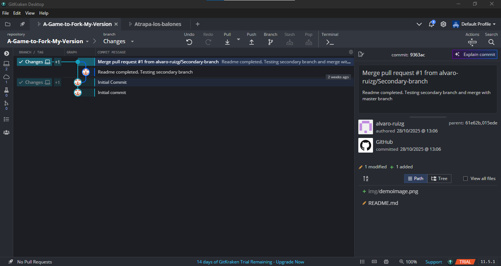
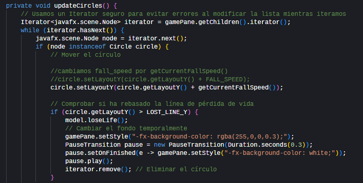

# Mi versión mejorada de A Game to Fork

Este proyecto es una versión modificada del juego original "A Game to Fork". 
Se han añadido nuevas funcionalidades para mejorar la jugabilidad y la experiencia del usuario.

---

## Funcionalidades añadidas

- Velocidad de los círculos aumenta según la puntuación.
- El fondo cambia de color cuando se pierde una vida.
- Preparación para añadir niveles de dificultad (Fácil, Normal, Difícil) mediante un ComboBox.

---

## Proceso de desarrollo

1. Creé un repositorio nuevo en GitHub vacío.
2. Cloné el repositorio en mi PC y abrí el proyecto con GitKraken.
3. Creé una nueva rama llamada `changes` para implementar las mejoras.
4. Modifiqué `GameController.java` para añadir la velocidad dinámica y el cambio de fondo.
5. Hice commit de los cambios en `changes`.
6. Fusioné (`merge`) la rama `changes` en la rama principal (`master`).
7. Hice push de la rama principal a mi repositorio remoto.

---

## Capturas del proyecto

Repositorio y rama creada:  
  

Rama `changes` creada:  
  

Gameplay con las mejoras:  

---

## Cómo ejecutar

1. Abrir el proyecto con IntelliJ.
2. Ejecutar `MainApplication.java`.
3. Disfrutar del juego con las mejoras implementadas.

---

## Uso de IA generativa para mejoras

Para implementar nuevas funcionalidades del juego, como:

- Aumento de velocidad de los círculos según la puntuación.
- Cambio de color del fondo al perder una vida.

se utilizó **ChatGPT (GPT-5 mini)** para generar sugerencias de código y lógica.

**Prompt utilizado:**

> "Quiero que la velocidad de los círculos aumente a medida que el jugador acumula más puntos,  
> y que el fondo cambie de color temporalmente al perder una vida.  
> Genera la lógica de GameController.java respetando la arquitectura Modelo-Controlador-Vista (MVC)."
